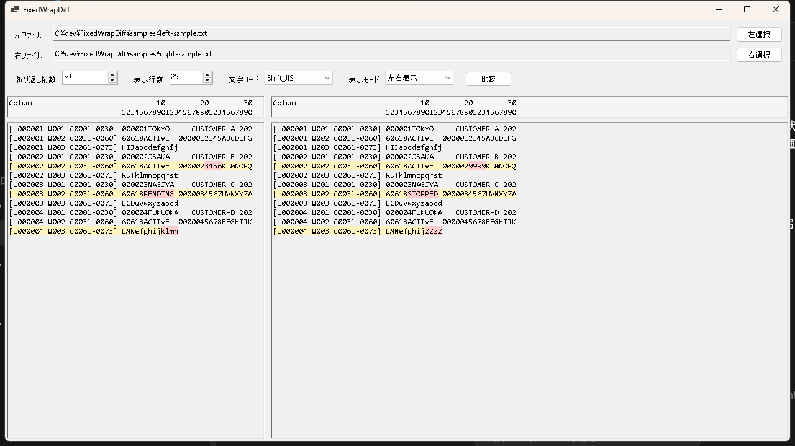

# FixedWrapDiff

FixedWrapDiff は、固定長テキストファイルを指定桁数で仮想的に折り返して比較する Windows 用ツールです。

WinMerge では「100桁ごとに折り返した状態で比較する」といった見方がしづらいため、長い固定長レコードを読みやすく比較することを目的にしています。

## 関連ツール

固定長テキスト確認を補助する別ツールとして、SpaceRunViewer も公開しています。

- [SpaceRunViewer](https://github.com/konikatsu/SpaceRunViewer): テキスト内の連続した空白部分を検出し、開始桁と文字数を一覧表示するツール

## ダウンロード

最新版は GitHub Releases からダウンロードできます。

[FixedWrapDiff-v0.5.0-win-x64.zip をダウンロード](https://github.com/konikatsu/FixedWrapDiff/releases/download/v0.5.0/FixedWrapDiff-v0.5.0-win-x64.zip)

zip を展開して、`FixedWrapDiff.exe` を起動してください。

この配布版は軽量版です。実行する PC に .NET 8 Desktop Runtime が入っていない場合は、起動時に .NET のダウンロード案内が表示されます。

.NET 8 Desktop Runtime は Microsoft 公式サイトから入手できます。

[.NET 8 Desktop Runtime をダウンロード](https://dotnet.microsoft.com/download/dotnet/8.0)

## 画面イメージ



## 主な機能

- 左右2つのテキストファイルを比較
- 元ファイルは変更しない
- 指定した桁数で各行を仮想的に折り返し
- 元行番号、折返番号、開始桁、終了桁を表示
- 行情報表示を `行+折返+桁` / `行+折返` / `行のみ` で切り替え可能
- 桁位置が分かるルーラー表示
- 比較結果のフォントサイズ指定
- 差分行を背景色で強調
- 差分行内の異なる文字位置も強調
- 左右表示、上下表示を切り替え可能
- 縦スクロール、横スクロールを同期
- Shift_JIS / UTF-8 に対応

## 表示例

`行+折返+桁` の場合:

```text
[L000001 W001 C0001-0100] xxxxxxxxxx
[L000001 W002 C0101-0200] xxxxxxxxxx
[L000001 W003 C0201-0300] xxxxxxxxxx
```

- `L000001`: 元ファイルの1行目
- `W001`: その行を折り返した1ブロック目
- `C0001-0100`: 元行内の1桁目から100桁目

`行のみ` に切り替えると、左端の表示を短くして比較結果の表示幅を広く使えます。

```text
[L000001] xxxxxxxxxx
```

## 使い方

1. 左ファイルを選択します。
2. 右ファイルを選択します。
3. 折り返し桁数を指定します。
4. フォントサイズを指定します。
5. 文字コードを選択します。
6. 表示モードを選択します。
7. 必要に応じて行情報の表示内容を選択します。
8. `比較` ボタンを押します。

## サンプル

リポジトリの `samples` フォルダに、動作確認用のサンプルファイルを含めています。

- `samples/left-sample.txt`
- `samples/right-sample.txt`

## 開発者向け

### 必要環境

- Windows
- .NET 8 SDK

### ビルド

```powershell
dotnet build
```

### 実行

```powershell
dotnet run
```

### Release 用 publish

```powershell
dotnet publish -c Release
```
