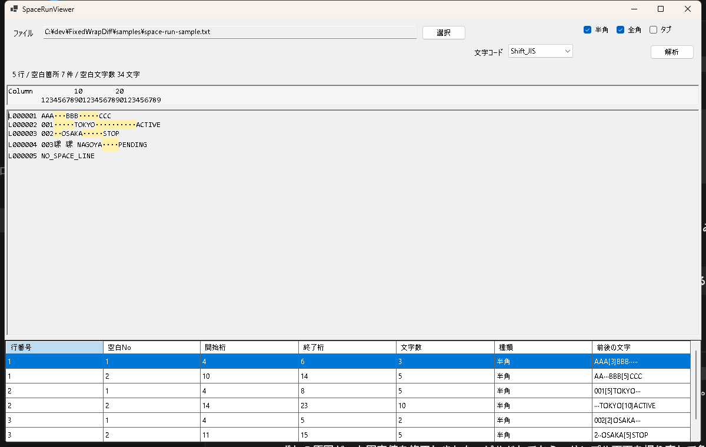

# SpaceRunViewer

SpaceRunViewer は、テキストファイル内の連続した空白部分を検出して、開始桁と文字数を確認するための Windows 用ツールです。

固定長テキストのレイアウト確認で、空白部分を手作業で選択して桁位置や文字数を数える作業を減らすことを目的にしています。

## 主な機能

- テキストファイルを読み込み
- 半角スペース、全角スペース、タブを対象として選択可能
- 連続した空白を1つの空白ブロックとして検出
- 本文上で空白部分を色付き表示
- 桁位置が分かるルーラー表示
- 空白ブロックごとに一覧表示
  - 行番号
  - 空白No
  - 開始桁
  - 終了桁
  - 文字数
  - 種類
  - 前後の文字
- 一覧の行を選択すると、本文側の該当空白を強調
- Shift_JIS / UTF-8 に対応

## 画面イメージ



## 使い方

1. ファイルを選択します。
2. 文字コードを選択します。
3. 対象にする空白種類を選択します。
4. `解析` ボタンを押します。
5. 下段の一覧で、空白の開始桁と文字数を確認します。

## 開発者向け

### ビルド

```powershell
dotnet build .\SpaceRunViewer\SpaceRunViewer.csproj
```

### 実行

```powershell
dotnet run --project .\SpaceRunViewer\SpaceRunViewer.csproj
```
